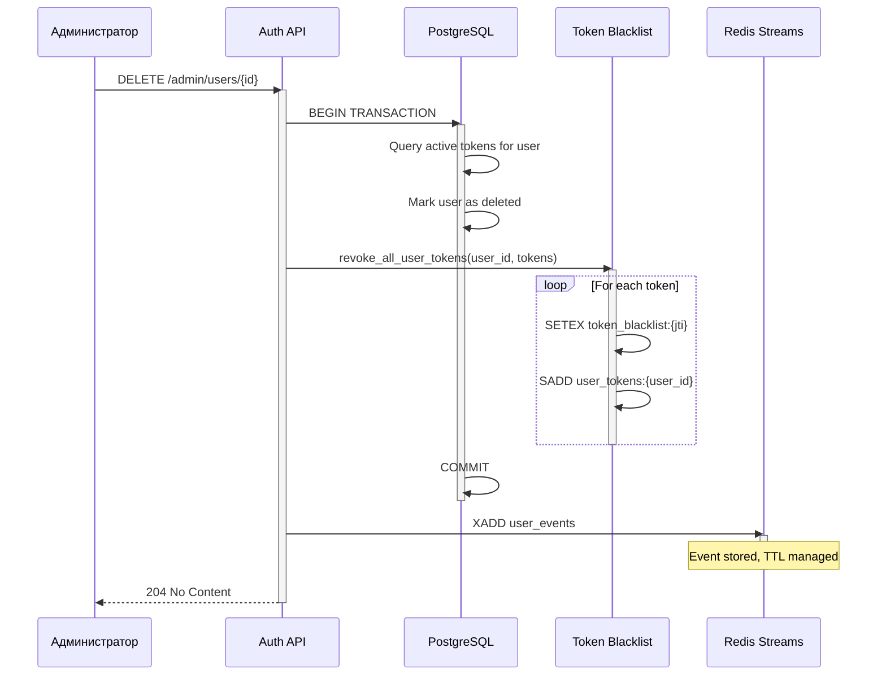

# Design: Event-Driven синхронизация и Token Blacklist (Auth Service)

**Версия:** 1.0.0  
**Дата:** 31 марта 2026

---

## 🏗️ Архитектура системы

### 1. Token Blacklist (Redis)

#### Структура данных

```
Redis Keys:
├── token_blacklist:{jti}         # Value: "1", TTL: exp - now
├── user_tokens:{user_id}         # Set[jti], TTL: max_exp - now
└── token_metadata:{jti}          # JSON metadata, TTL: exp - now

Example:
├── token_blacklist:550e8400-e29b-41d4-a716-446655440000
│   Value: "1"
│   TTL: 3600 (1 час)
│
├── user_tokens:123e4567-e89b-12d3-a456-426614174000
│   Members: ["550e8400-e29b-41d4-a716-446655440000", ...]
│   TTL: 7200
│
└── token_metadata:550e8400-e29b-41d4-a716-446655440000
    {
      "user_id": "123e4567-e89b-12d3-a456-426614174000",
      "reason": "user_deleted",
      "revoked_at": 1711960590,
      "admin_id": null
    }
```

#### TTL Strategy

- **TTL** = token expiration - now (дает гарантию что при возможности replay blacklist даст верный ответ)
- **Минимальный TTL** = 3600 секунд (1 час) даже если токен скоро истекает
- **Auto-cleanup** через Redis TTL механизм (никакого manual cleanup не требуется)

### 2. Event Publisher (Redis Streams)

#### Stream Schema

```
Stream: user_events
├── Message ID: 1711960590000-0 (автогенерируемый Redis)
├── Fields:
│   ├── event_id: UUID (уникальный ID события)
│   ├── event_type: string (user.created, user.updated, user.deleted)
│   ├── event_version: string (1.0)
│   ├── timestamp: ISO8601 (2026-03-31T11:16:30Z)
│   ├── aggregate_type: string (user)
│   ├── aggregate_id: UUID (user_id)
│   ├── correlation_id: UUID (для tracing)
│   ├── source: string (auth-service)
│   └── data: JSON string
```

#### Event Types

```json
{
  "user.created": {
    "data": {
      "user_id": "UUID",
      "email": "string",
      "first_name": "string",
      "last_name": "string",
      "created_at": "ISO8601"
    }
  },
  "user.updated": {
    "data": {
      "user_id": "UUID",
      "email": "string",
      "first_name": "string",
      "last_name": "string",
      "updated_at": "ISO8601",
      "changes": ["email", "last_name"]
    }
  },
  "user.deleted": {
    "data": {
      "user_id": "UUID",
      "email": "string",
      "deleted_at": "ISO8601",
      "reason": "admin_deletion | user_requested",
      "admin_id": "UUID | null"
    }
  }
}
```

#### Configuration

```yaml
Stream Settings:
  stream_key: "user_events"
  dlq_stream_key: "user_events_dlq"
  max_stream_length: 100000  # Approximate MAXLEN
  consumer_group: "auth_service_group"  # For tracking
```

### 3. Sequence Diagrams

#### Диаграмма 3.1: Удаление пользователя



#### Диаграмма 3.2: Валидация токена (с blacklist проверкой)

```mermaid
sequenceDiagram
    participant Client
    participant CoreAPI as Core Service API
    participant Middleware as Middleware
    participant TokenBL as Token Blacklist
    participant JWKS as JWKS Client
    
    Client->>CoreAPI: GET /my/projects (Authorization: Bearer token)
    activate CoreAPI
    
    CoreAPI->>Middleware: dispatch()
    activate Middleware
    
    Middleware->>JWKS: validate_token(token)
    activate JWKS
    JWKS-->>Middleware: payload = {sub, jti, exp, ...}
    deactivate JWKS
    
    Middleware->>TokenBL: is_token_revoked(jti)
    activate TokenBL
    
    alt Token in blacklist
        TokenBL-->>Middleware: TRUE
        Middleware-->>Client: 401 Unauthorized (Token revoked)
        deactivate TokenBL
    else Token NOT in blacklist
        TokenBL-->>Middleware: FALSE
        deactivate TokenBL
        
        Middleware->>Middleware: inject user_id to request.state
        Middleware->>Middleware: call next handler
        
        Note over CoreAPI: Process request normally
        
        Middleware-->>Client: 200 OK
    end
    
    deactivate Middleware
    deactivate CoreAPI
```

### 4. API Contracts

#### TokenBlacklistService

```python
class TokenBlacklistService:
    async def revoke_token(
        self,
        token_jti: str,
        user_id: str,
        exp_timestamp: int,
        reason: str = "user_requested",
        admin_id: Optional[str] = None
    ) -> bool:
        """Отозвать один токен"""
        
    async def revoke_all_user_tokens(
        self,
        user_id: str,
        token_list: list[tuple[str, int]],  # [(jti, exp), ...]
        reason: str = "user_deleted",
        admin_id: Optional[str] = None
    ) -> int:
        """Отозвать все токены пользователя"""
        
    async def is_token_revoked(self, token_jti: str) -> bool:
        """Проверить если токен отозван"""
        
    async def get_token_metadata(self, token_jti: str) -> Optional[dict]:
        """Получить метаданные отзыва"""
```

#### EventPublisher

```python
class RedisStreamsPublisher:
    async def publish_event(
        self,
        event_type: str,
        aggregate_type: str,
        aggregate_id: str,
        data: dict[str, Any],
        correlation_id: Optional[str] = None
    ) -> str:
        """Publish event to Redis Stream, returns message_id"""
```

### 5. Database Schema Changes

#### Новые колонки в таблице User (если нужны)

```sql
ALTER TABLE users ADD COLUMN (
    is_deleted BOOLEAN DEFAULT FALSE,
    deleted_at TIMESTAMP WITH TIME ZONE,
    deletion_reason VARCHAR(50)
);

CREATE INDEX idx_users_deleted ON users(is_deleted, deleted_at);
```

#### Миграция для Alembic

```python
# migrations/versions/2026_03_31_add_user_deletion_fields.py

def upgrade():
    op.add_column('users', 
        sa.Column('is_deleted', sa.Boolean(), nullable=False, server_default='false'))
    op.add_column('users',
        sa.Column('deleted_at', sa.DateTime(timezone=True), nullable=True))
    op.add_column('users',
        sa.Column('deletion_reason', sa.String(50), nullable=True))
    op.create_index(
        'idx_users_deleted',
        'users',
        ['is_deleted', 'deleted_at']
    )

def downgrade():
    op.drop_index('idx_users_deleted')
    op.drop_column('users', 'deletion_reason')
    op.drop_column('users', 'deleted_at')
    op.drop_column('users', 'is_deleted')
```

### 6. Configuration & Environment

```yaml
# .env (shared settings)

# Redis
REDIS_HOST=redis
REDIS_PORT=6379
REDIS_DB=0
REDIS_URL=redis://${REDIS_HOST}:${REDIS_PORT}/${REDIS_DB}

# Event Configuration
EVENT_BROKER_TYPE=redis_streams
USE_TOKEN_BLACKLIST=true
USE_EVENT_SYNC=true
REDIS_STREAM_KEY=user_events
REDIS_DLQ_STREAM_KEY=user_events_dlq
REDIS_STREAM_MAX_LENGTH=100000

# Event Processing
EVENT_MAX_RETRIES=5
EVENT_INITIAL_RETRY_DELAY=5
EVENT_MAX_RETRY_DELAY=300

# JWT
JWT_ISSUER=https://auth.codelab.dev
JWT_AUDIENCE=codelab-services
```

### 7. Graceful Degradation

Если Redis недоступен (для blacklist):

```python
class TokenBlacklistService:
    async def is_token_revoked(self, token_jti: str) -> bool:
        try:
            blacklist_key = f"token_blacklist:{token_jti}"
            result = await self.redis.exists(blacklist_key)
            return bool(result)
        except RedisConnectionError:
            logger.error("redis_unavailable_for_blacklist_check")
            # Fallback: rely only on exp claim in JWT
            # Token will be valid until exp, risk but system stays up
            return False
```

Если Redis недоступен (для publisher):

```python
class RedisStreamsPublisher:
    async def publish_event(self, ...) -> str:
        try:
            message_id = await self.redis.xadd(...)
            return message_id
        except RedisConnectionError:
            logger.error("redis_unavailable_cannot_publish_event")
            # Store event in persistent queue или retry later
            # DON'T fail the deletion, log and alert
            # Core-service won't sync, but user deletion still works
            raise  # Raise for alerting, but main flow continues
```

---

## 📊 Диаграмма компонентов

```
┌─────────────────────────────────────────────────────┐
│              Codelab Auth Service                   │
│                                                     │
│  ┌──────────────────────┐                          │
│  │   User Management    │                          │
│  │    API Endpoints     │                          │
│  └──────────┬───────────┘                          │
│             │ user.deleted event                  │
│             ▼                                       │
│  ┌──────────────────────────────────────────────┐ │
│  │        User Deletion Flow                    │ │
│  │                                              │ │
│  │  1. Get active tokens                        │ │
│  │  2. Revoke in blacklist (Redis)             │ │
│  │  3. Update DB (is_deleted=true)             │ │
│  │  4. Publish event to broker                 │ │
│  └──────┬─────────────────────────────────────┘ │
│         │                                        │
│  ┌──────▼──────────────────────────────────────┐ │
│  │   Token Blacklist Service                   │ │
│  │  (Redis Streams + Hash + Set)              │ │
│  │                                             │ │
│  │  - SETEX token_blacklist:{jti}            │ │
│  │  - SADD user_tokens:{user_id}             │ │
│  │  - Auto TTL cleanup                       │ │
│  └─────────────────────────────────────────────┘ │
│         │                                        │
│  ┌──────▼──────────────────────────────────────┐ │
│  │   Event Publisher (Redis Streams)           │ │
│  │                                             │ │
│  │  - XADD user_events (stream)               │ │
│  │  - Event envelope with metadata            │ │
│  │  - MAXLEN pruning                          │ │
│  └─────────────────────────────────────────────┘ │
│                                                     │
└─────────────────────────────────────────────────────┘
         │
         │ Pub/Sub: user.created, user.updated, user.deleted
         │
┌────────▼─────────────────────────────────────────────┐
│         Redis Broker (Streams)                       │
│                                                      │
│  Stream: user_events                                │
│  │                                                  │
│  ├─ Message: {event_id, event_type, data, ...}    │
│  ├─ Message: ...                                   │
│  └─ Message: ...                                   │
│                                                      │
│  DLQ Stream: user_events_dlq                        │
│  └─ Failed events for manual inspection            │
└────────────────────────────────────────────────────┘
```

---

## 🔧 Error Handling

### Сценарии ошибок

1. **Redis недоступен при revoke**
   - Логирование ошибки
   - Alert в мониторинг
   - Graceful fallback (rely on exp)
   - Retry в background job (будущее)

2. **Event не публикуется**
   - Ошибка логируется
   - Транзакция БД уже committed (данные удалены)
   - Event может быть переопубликован (idempotent)
   - DLQ мониторинг

3. **Core-service не обработает event**
   - Событие остается в stream
   - Consumer с retry logic
   - Max retries → DLQ

### Logging Strategy

```python
logger.info(
    "token_revoked",
    token_jti=token_jti,
    user_id=user_id,
    reason=reason,
    ttl_seconds=ttl
)

logger.error(
    "token_revoke_error",
    token_jti=token_jti,
    error=str(e),
    exc_info=True
)

logger.info(
    "event_published",
    event_id=event_id,
    event_type=event_type,
    aggregate_id=aggregate_id,
    message_id=message_id
)
```

---

## ✅ Acceptance Criteria

- ✅ Отозванный токен блокируется в течение 100ms
- ✅ Redis TTL очищает blacklist автоматически
- ✅ События доставляются в core-service с rate > 99%
- ✅ Нет потери данных при перезагрузке Redis (stream retained)
- ✅ Graceful degradation если Redis down
