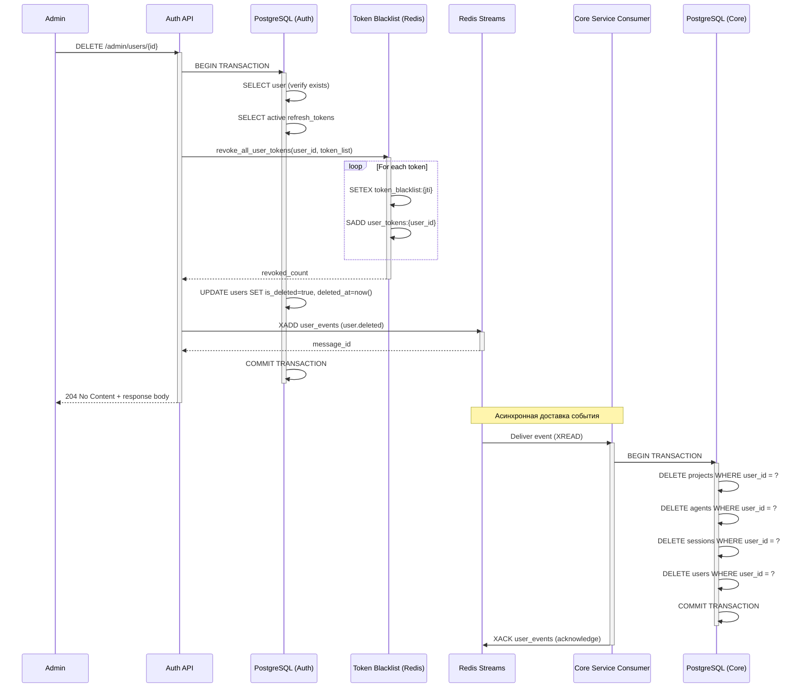

# Спецификация: User Deletion Flow

**Версия:** 1.0.0  
**Дата:** 31 марта 2026  
**Сервис:** codelab-auth-service

---

## 📋 Назначение компонента

**User Deletion Flow** — полный workflow удаления пользователя с гарантией целостности данных между auth-service и core-service. Обеспечивает:

1. ✅ Отзыв всех активных токенов пользователя (blacklist)
2. ✅ Обновление статуса пользователя в БД
3. ✅ Публикация события для core-service
4. ✅ Транзакционная консистентность (ACID)

---

## 🔌 API

### Endpoint: DELETE /admin/users/{user_id}

```python
@router.delete("/admin/users/{user_id}")
async def delete_user(
    user_id: UUID,
    session: AsyncSession = Depends(get_db)
) -> DeleteUserResponse:
    """
    Удалить пользователя и все связанные данные
    
    Path Parameters:
        user_id (UUID): UUID пользователя для удаления
    
    Query Parameters:
        None
    
    Headers:
        Authorization: Bearer {admin_token}  (с admin ролью)
    
    Returns:
        DeleteUserResponse:
        {
            "status": "deleted",
            "user_id": "UUID",
            "tokens_revoked": int,
            "event_id": "UUID",
            "deleted_at": "ISO8601",
            "cascade_status": "pending"  (в core-service)
        }
    
    Raises:
        404 Not Found: если пользователь не существует
        401 Unauthorized: если не admin
        500 Internal Server Error: если ошибка при удалении
    
    Side Effects:
        1. Отозвать все токены пользователя в Redis blacklist
        2. Обновить user.is_deleted = true в PostgreSQL
        3. Опубликовать user.deleted событие в Redis Streams
        4. Trigger CASCADE delete в core-service (асинхронно)
    """
```

---

## 📊 Workflow Diagram



---

## 🔄 Step-by-Step Flow

### Phase 1: Валидация (Auth Service)

```
1. GET /admin/users/{user_id}
   └─ Verify user exists
   └─ Verify caller is admin
   └─ Check if already deleted (is_deleted=true)
```

### Phase 2: Revoke Tokens (Auth Service)

```
2. Query active tokens for user
   └─ SELECT FROM refresh_tokens
      WHERE user_id = ? AND exp > NOW()
   └─ Extract: jti, exp_timestamp for each token

3. Revoke all tokens in blacklist
   └─ TokenBlacklistService.revoke_all_user_tokens()
   └─ SETEX token_blacklist:{jti} (batch via pipeline)
   └─ SADD user_tokens:{user_id} (all jtis)
```

### Phase 3: Update Auth DB (Auth Service)

```
4. BEGIN TRANSACTION
   └─ UPDATE users SET is_deleted=true, deleted_at=NOW()
   └─ COMMIT
   └─ (Optional: soft delete, never actually remove for audit)
```

### Phase 4: Publish Event (Auth Service)

```
5. Publish user.deleted event
   └─ EventPublisher.publish_event()
   └─ XADD user_events stream
   └─ Event: {event_type, aggregate_id, data, ...}
```

### Phase 5: Response (Auth Service)

```
6. Return success response
   └─ Status: deleted
   └─ Tokens revoked: N
   └─ Event ID: UUID
   └─ Cascade status: pending
```

### Phase 6: Async Processing (Core Service)

```
7. EventConsumer receives user.deleted event
   └─ XREAD from user_events
   └─ Parse event payload
   └─ Get user_id from event

8. Cascade delete in Core DB
   └─ BEGIN TRANSACTION
   └─ DELETE UserProject WHERE user_id = ?
   └─ DELETE UserAgent WHERE user_id = ?
   └─ DELETE ChatSession WHERE user_id = ?
   └─ DELETE User WHERE id = ?
   └─ COMMIT

9. Acknowledge event
   └─ XACK user_events
   └─ Event successfully processed
```

---

## 📊 Schemas

### Request Schema

```python
class DeleteUserRequest:
    """DELETE /admin/users/{user_id}"""
    user_id: UUID  # Path parameter
    # No body required
```

### Response Schema

```python
class DeleteUserResponse:
    status: str  # "deleted"
    user_id: str  # UUID
    tokens_revoked: int  # Количество отозванных токенов
    event_id: str  # UUID события
    deleted_at: str  # ISO8601 timestamp
    cascade_status: str  # "pending" (в core-service)
    
    class Config:
        example = {
            "status": "deleted",
            "user_id": "123e4567-e89b-12d3-a456-426614174000",
            "tokens_revoked": 3,
            "event_id": "550e8400-e29b-41d4-a716-446655440000",
            "deleted_at": "2026-03-31T12:00:00Z",
            "cascade_status": "pending"
        }
```

### Event Payload (user.deleted)

```python
class UserDeletedEvent:
    event_type: str  # "user.deleted"
    aggregate_type: str  # "user"
    aggregate_id: str  # UUID (user_id)
    timestamp: str  # ISO8601
    correlation_id: str  # UUID (for tracing)
    source: str  # "auth-service"
    data: dict = {
        "user_id": str,  # UUID
        "email": str,
        "deleted_at": str,  # ISO8601
        "reason": str,  # "admin_deletion" | "user_requested"
        "admin_id": str | None  # UUID if admin-initiated
    }
```

---

## 🔄 Примеры использования

### Пример 1: Admin удаляет пользователя

```bash
curl -X DELETE \
  "https://auth.codelab.dev/admin/users/123e4567-e89b-12d3-a456-426614174000" \
  -H "Authorization: Bearer admin_token" \
  -H "Content-Type: application/json"

# Response:
{
  "status": "deleted",
  "user_id": "123e4567-e89b-12d3-a456-426614174000",
  "tokens_revoked": 3,
  "event_id": "550e8400-e29b-41d4-a716-446655440000",
  "deleted_at": "2026-03-31T12:00:00Z",
  "cascade_status": "pending"
}
```

### Пример 2: Backend implementation

```python
from app.services.token_blacklist_service import get_token_blacklist_service
from app.services.event_publisher import get_event_publisher
from app.models.user import User
from app.models.token import RefreshToken
from sqlalchemy import select
from datetime import datetime, timezone

@router.delete("/admin/users/{user_id}")
async def delete_user(
    user_id: UUID,
    request: Request,
    session: AsyncSession = Depends(get_db)
):
    """Delete user with cascade"""
    
    # 1. Verify admin
    if not request.state.is_admin:
        raise HTTPException(status_code=401, detail="Not authorized")
    
    # 2. Get user
    user = await session.get(User, user_id)
    if not user:
        raise HTTPException(status_code=404, detail="User not found")
    
    # 3. Get active tokens
    result = await session.execute(
        select(RefreshToken).where(
            (RefreshToken.user_id == user_id) &
            (RefreshToken.exp > datetime.now(timezone.utc))
        )
    )
    tokens = result.scalars().all()
    token_list = [(t.jti, int(t.exp.timestamp())) for t in tokens]
    
    # 4. Revoke all tokens in blacklist
    blacklist_service = await get_token_blacklist_service()
    revoked_count = await blacklist_service.revoke_all_user_tokens(
        user_id=str(user_id),
        token_list=token_list,
        reason="admin_deletion"
    )
    
    # 5. Begin transaction for DB update
    try:
        async with session.begin():
            user.is_deleted = True
            user.deleted_at = datetime.now(timezone.utc)
            await session.flush()
        
        # 6. Publish event (AFTER commit)
        publisher = await get_event_publisher()
        event_id = await publisher.publish_event(
            event_type="user.deleted",
            aggregate_type="user",
            aggregate_id=str(user_id),
            data={
                "user_id": str(user_id),
                "email": user.email,
                "deleted_at": datetime.now(timezone.utc).isoformat() + "Z",
                "reason": "admin_deletion"
            }
        )
        
        logger.info(
            "user_deleted",
            user_id=user_id,
            tokens_revoked=revoked_count,
            event_id=event_id
        )
        
        return {
            "status": "deleted",
            "user_id": str(user_id),
            "tokens_revoked": revoked_count,
            "event_id": event_id,
            "deleted_at": user.deleted_at.isoformat() + "Z",
            "cascade_status": "pending"
        }
    
    except Exception as e:
        logger.error("user_deletion_failed", user_id=user_id, error=str(e))
        raise
```

---

## ⚠️ Обработка ошибок

### Сценарий 1: Redis недоступен при revoke

```python
try:
    revoked_count = await blacklist_service.revoke_all_user_tokens(...)
except RedisConnectionError:
    logger.error("redis_unavailable_during_revoke", user_id=user_id)
    # Вариант 1: Fail deletion (требует Redis)
    raise HTTPException(status_code=503, detail="Service temporarily unavailable")
    
    # Вариант 2: Continue anyway (рискованно, но система работает)
    # revoked_count = 0
    # logger.warning("proceeding_without_revoke")
```

### Сценарий 2: Event не публикуется

```python
try:
    event_id = await publisher.publish_event(...)
except RedisConnectionError:
    logger.error("event_publish_failed", user_id=user_id)
    # БД уже updated, но события нет
    # Стратегия: логировать, alert, retry позже
    event_id = None
    # НЕ откатываем удаление
```

### Сценарий 3: User not found

```python
user = await session.get(User, user_id)
if not user:
    raise HTTPException(
        status_code=404,
        detail=f"User {user_id} not found"
    )
```

### Сценарий 4: User already deleted

```python
if user.is_deleted:
    raise HTTPException(
        status_code=400,
        detail=f"User {user_id} already deleted at {user.deleted_at}"
    )
```

---

## 🧪 Тесты

### Integration Test 1: Full deletion flow

```python
@pytest.mark.asyncio
async def test_user_deletion_flow():
    """Test complete user deletion with cascade"""
    
    # Setup
    user_id = UUID("123e4567-e89b-12d3-a456-426614174000")
    await create_test_user(user_id)
    await create_test_tokens(user_id, count=3)
    
    # Act: Delete user
    response = await client.delete(
        f"/admin/users/{user_id}",
        headers={"Authorization": "Bearer admin_token"}
    )
    
    # Assert response
    assert response.status_code == 200
    assert response.json()["status"] == "deleted"
    assert response.json()["tokens_revoked"] == 3
    
    # Assert user deleted in DB
    user = await db.get_user(user_id)
    assert user.is_deleted == True
    assert user.deleted_at is not None
    
    # Assert tokens in blacklist
    for token_jti in ["jti-1", "jti-2", "jti-3"]:
        is_revoked = await blacklist_service.is_token_revoked(token_jti)
        assert is_revoked == True
    
    # Assert event published
    events = await redis.xread({"user_events": "0"})
    assert len(events) > 0
    last_event = events[0][1][-1][1]
    assert last_event[b"event_type"] == b"user.deleted"
    
    # Assert core-service processes event
    await asyncio.sleep(2)  # Wait for consumer
    core_user = await core_db.get_user(user_id)
    assert core_user is None  # Cascade deleted
```

### Unit Test 1: Token revocation during deletion

```python
@pytest.mark.asyncio
async def test_token_revocation_on_delete():
    """Test tokens are revoked when user is deleted"""
    
    user_id = "user-123"
    token_list = [
        ("jti-1", int(time.time()) + 3600),
        ("jti-2", int(time.time()) + 7200),
    ]
    
    revoked = await blacklist_service.revoke_all_user_tokens(
        user_id=user_id,
        token_list=token_list
    )
    
    assert revoked == 2
    
    for jti, _ in token_list:
        assert await blacklist_service.is_token_revoked(jti) == True
```

---

## 📋 Acceptance Criteria

- ✅ DELETE endpoint принимает user_id
- ✅ Все активные токены отозваны (в blacklist)
- ✅ User.is_deleted = true в БД
- ✅ Event опубликован в stream
- ✅ Response содержит все требуемые поля
- ✅ Core-service получает событие и удаляет данные (async)
- ✅ Graceful degradation если Redis down
- ✅ Транзакция ACID в БД
- ✅ Логирование полное (каждый шаг)
- ✅ Unit тесты: 100% coverage
- ✅ Integration тесты: full flow работает
- ✅ E2E тесты: API работает end-to-end

---

## 🔗 Связанные компоненты

- [`TokenBlacklistService`](../token-blacklist-service/spec.md)
- [`EventPublisher`](../event-publisher/spec.md)
- `EventConsumer` в core-service
