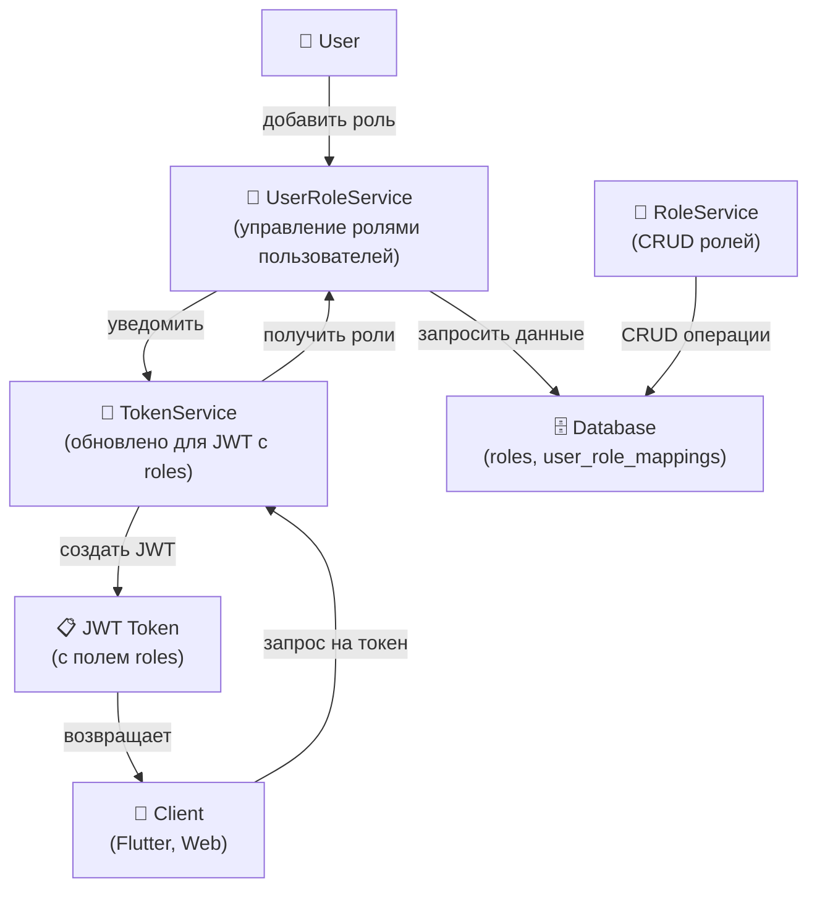
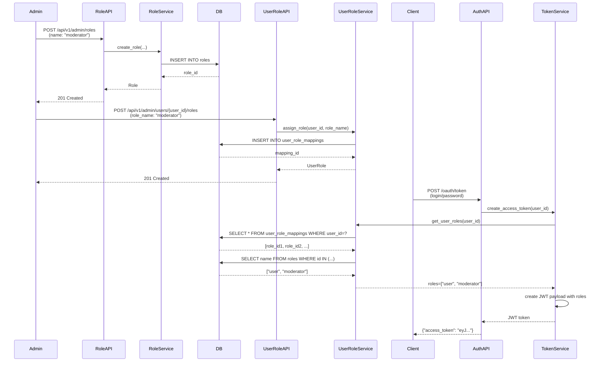

# Design: RBAC Phase 1 - User Roles Management

**Версия:** 1.0.0  
**Дата:** 5 апреля 2026  
**Статус:** 📋 Design Document

---

## 1. Архитектура системы

### 1.1 Компоненты



### 1.2 Data Flow



---

## 2. Database Schema

### 2.1 ER Diagram

```mermaid
erDiagram
    USERS ||--o{ USER_ROLE_MAPPINGS : "has"
    ROLES ||--o{ USER_ROLE_MAPPINGS : "assigned_via"
    
    USERS {
        uuid id PK
        string email
        string password_hash
        boolean email_verified
        timestamp created_at
        timestamp updated_at
    }
    
    ROLES {
        uuid id PK
        string name UK "admin, user, moderator"
        string display_name
        text description
        boolean system_defined "true для встроенных ролей"
        timestamp created_at
        timestamp updated_at
    }
    
    USER_ROLE_MAPPINGS {
        uuid id PK
        uuid user_id FK "references users(id)"
        uuid role_id FK "references roles(id)"
        timestamp created_at
        string "UNIQUE(user_id, role_id)"
    }
```

### 2.2 SQL Schema

```sql
-- Таблица ролей
CREATE TABLE roles (
  id UUID PRIMARY KEY DEFAULT gen_random_uuid(),
  name VARCHAR(255) NOT NULL UNIQUE,
  display_name VARCHAR(255),
  description TEXT,
  system_defined BOOLEAN DEFAULT FALSE,
  created_at TIMESTAMP NOT NULL DEFAULT CURRENT_TIMESTAMP,
  updated_at TIMESTAMP NOT NULL DEFAULT CURRENT_TIMESTAMP
);

-- Индексы для ролей
CREATE INDEX idx_roles_name ON roles(name);
CREATE INDEX idx_roles_system_defined ON roles(system_defined);

-- Таблица связей пользователей и ролей
CREATE TABLE user_role_mappings (
  id UUID PRIMARY KEY DEFAULT gen_random_uuid(),
  user_id UUID NOT NULL REFERENCES users(id) ON DELETE CASCADE,
  role_id UUID NOT NULL REFERENCES roles(id) ON DELETE CASCADE,
  created_at TIMESTAMP NOT NULL DEFAULT CURRENT_TIMESTAMP,
  UNIQUE(user_id, role_id)
);

-- Индексы для быстрого поиска
CREATE INDEX idx_user_role_mappings_user_id ON user_role_mappings(user_id);
CREATE INDEX idx_user_role_mappings_role_id ON user_role_mappings(role_id);
```

### 2.3 Seed Data

```sql
-- Предустановленные роли
INSERT INTO roles (name, display_name, description, system_defined, created_at, updated_at)
VALUES
  ('admin', 'Administrator', 'Полный доступ ко всем функциям системы', TRUE, NOW(), NOW()),
  ('moderator', 'Moderator', 'Модератор контента и управления пользователями', TRUE, NOW(), NOW()),
  ('user', 'User', 'Обычный пользователь', TRUE, NOW(), NOW());
```

---

## 3. Models (SQLAlchemy 2.0+)

### 3.1 Role Model

```python
from sqlalchemy import Column, String, Boolean, DateTime, Index
from sqlalchemy.dialects.postgresql import UUID
from datetime import datetime
import uuid

class Role(Base):
    """Модель роли пользователя в системе.
    
    Роль определяет набор разрешений и доступов для пользователя.
    Может быть системной (предустановленной) или пользовательской.
    """
    
    __tablename__ = "roles"
    
    # Поля
    id: Mapped[uuid.UUID] = mapped_column(
        UUID(as_uuid=True),
        primary_key=True,
        default=uuid.uuid4
    )
    name: Mapped[str] = mapped_column(
        String(255),
        unique=True,
        nullable=False,
        comment="Уникальное имя роли (admin, user, moderator и т.д.)"
    )
    display_name: Mapped[str | None] = mapped_column(
        String(255),
        nullable=True,
        comment="Отображаемое имя для UI"
    )
    description: Mapped[str | None] = mapped_column(
        String(1000),
        nullable=True,
        comment="Описание роли и её назначения"
    )
    system_defined: Mapped[bool] = mapped_column(
        Boolean,
        default=False,
        nullable=False,
        comment="true для встроенных ролей (admin, user, moderator)"
    )
    created_at: Mapped[datetime] = mapped_column(
        DateTime,
        default=datetime.utcnow,
        nullable=False
    )
    updated_at: Mapped[datetime] = mapped_column(
        DateTime,
        default=datetime.utcnow,
        onupdate=datetime.utcnow,
        nullable=False
    )
    
    # Отношения
    user_role_mappings: Mapped[list["UserRoleMapping"]] = relationship(
        "UserRoleMapping",
        back_populates="role",
        cascade="all, delete-orphan",
        lazy="select"
    )
    
    # Индексы
    __table_args__ = (
        Index('idx_roles_name', 'name'),
        Index('idx_roles_system_defined', 'system_defined'),
    )
```

### 3.2 UserRoleMapping Model

```python
class UserRoleMapping(Base):
    """Связь между пользователем и ролью.
    
    Таблица user_role_mappings хранит N:M отношение между
    пользователями и ролями.
    """
    
    __tablename__ = "user_role_mappings"
    
    # Поля
    id: Mapped[uuid.UUID] = mapped_column(
        UUID(as_uuid=True),
        primary_key=True,
        default=uuid.uuid4
    )
    user_id: Mapped[uuid.UUID] = mapped_column(
        UUID(as_uuid=True),
        ForeignKey("users.id", ondelete="CASCADE"),
        nullable=False
    )
    role_id: Mapped[uuid.UUID] = mapped_column(
        UUID(as_uuid=True),
        ForeignKey("roles.id", ondelete="CASCADE"),
        nullable=False
    )
    created_at: Mapped[datetime] = mapped_column(
        DateTime,
        default=datetime.utcnow,
        nullable=False
    )
    
    # Отношения
    user: Mapped["User"] = relationship("User", back_populates="user_role_mappings")
    role: Mapped["Role"] = relationship("Role", back_populates="user_role_mappings")
    
    # Индексы
    __table_args__ = (
        UniqueConstraint('user_id', 'role_id', name='uq_user_role'),
        Index('idx_user_role_mappings_user_id', 'user_id'),
        Index('idx_user_role_mappings_role_id', 'role_id'),
    )
```

### 3.3 User Model (обновление)

```python
class User(Base):
    # ... существующие поля ...
    
    # Добавить отношение к ролям
    user_role_mappings: Mapped[list["UserRoleMapping"]] = relationship(
        "UserRoleMapping",
        back_populates="user",
        cascade="all, delete-orphan",
        lazy="select"
    )
    
    @property
    def roles(self) -> list[str]:
        """Получить список имен ролей пользователя."""
        return [mapping.role.name for mapping in self.user_role_mappings]
```

---

## 4. Services

### 4.1 RoleService

```python
class RoleService:
    """Сервис для управления ролями (CRUD операции).
    
    Методы:
    - create_role() — создать новую роль
    - get_role() — получить роль по ID
    - get_role_by_name() — получить роль по имени
    - list_roles() — получить список всех ролей
    - update_role() — обновить данные роли
    - delete_role() — удалить роль
    """
    
    async def create_role(
        self,
        db: AsyncSession,
        name: str,
        display_name: str | None = None,
        description: str | None = None
    ) -> Role:
        """Создать новую роль.
        
        Args:
            db: Database session
            name: Уникальное имя роли (admin, moderator и т.д.)
            display_name: Отображаемое имя (опционально)
            description: Описание роли (опционально)
        
        Returns:
            Созданная роль
        
        Raises:
            RoleAlreadyExistsError: Если роль с таким именем уже существует
        """
        # Проверить что роль не существует
        existing = await self.get_role_by_name(db, name)
        if existing:
            raise RoleAlreadyExistsError(f"Role '{name}' already exists")
        
        role = Role(
            name=name,
            display_name=display_name or name.title(),
            description=description
        )
        db.add(role)
        await db.commit()
        await db.refresh(role)
        return role
    
    async def get_role(self, db: AsyncSession, role_id: uuid.UUID) -> Role | None:
        """Получить роль по ID."""
        result = await db.execute(
            select(Role).where(Role.id == role_id)
        )
        return result.scalar_one_or_none()
    
    async def get_role_by_name(self, db: AsyncSession, name: str) -> Role | None:
        """Получить роль по имени."""
        result = await db.execute(
            select(Role).where(Role.name == name)
        )
        return result.scalar_one_or_none()
    
    async def list_roles(self, db: AsyncSession) -> list[Role]:
        """Получить список всех ролей."""
        result = await db.execute(select(Role))
        return result.scalars().all()
    
    async def update_role(
        self,
        db: AsyncSession,
        role_id: uuid.UUID,
        display_name: str | None = None,
        description: str | None = None
    ) -> Role | None:
        """Обновить данные роли (но не имя!)."""
        role = await self.get_role(db, role_id)
        if not role:
            return None
        
        if display_name is not None:
            role.display_name = display_name
        if description is not None:
            role.description = description
        
        await db.commit()
        await db.refresh(role)
        return role
    
    async def delete_role(self, db: AsyncSession, role_id: uuid.UUID) -> bool:
        """Удалить роль (удалит и все user_role_mappings за счет CASCADE)."""
        role = await self.get_role(db, role_id)
        if not role:
            return False
        
        # Защита от удаления системных ролей (опционально)
        if role.system_defined:
            raise SystemRoleCannotBeDeletedError(f"Cannot delete system role '{role.name}'")
        
        await db.delete(role)
        await db.commit()
        return True
```

### 4.2 UserRoleService

```python
class UserRoleService:
    """Сервис для управления ролями пользователей.
    
    Методы:
    - assign_role() — назначить роль пользователю
    - remove_role() — удалить роль пользователя
    - get_user_roles() — получить роли пользователя
    - has_role() — проверить есть ли у пользователя роль
    """
    
    async def assign_role(
        self,
        db: AsyncSession,
        user_id: uuid.UUID,
        role_name: str
    ) -> UserRoleMapping:
        """Назначить роль пользователю.
        
        Args:
            db: Database session
            user_id: ID пользователя
            role_name: Имя роли (admin, user, moderator и т.д.)
        
        Returns:
            Созданная связь пользователя и роли
        
        Raises:
            UserNotFoundError: Если пользователь не найден
            RoleNotFoundError: Если роль не найдена
            UserAlreadyHasRoleError: Если пользователь уже имеет эту роль
        """
        # Проверить что пользователь существует
        user = await self._get_user(db, user_id)
        if not user:
            raise UserNotFoundError(f"User '{user_id}' not found")
        
        # Получить роль по имени
        role_service = RoleService()
        role = await role_service.get_role_by_name(db, role_name)
        if not role:
            raise RoleNotFoundError(f"Role '{role_name}' not found")
        
        # Проверить что пользователь ещё не имеет эту роль
        existing = await db.execute(
            select(UserRoleMapping).where(
                (UserRoleMapping.user_id == user_id) &
                (UserRoleMapping.role_id == role.id)
            )
        )
        if existing.scalar_one_or_none():
            raise UserAlreadyHasRoleError(
                f"User '{user_id}' already has role '{role_name}'"
            )
        
        # Создать связь
        mapping = UserRoleMapping(user_id=user_id, role_id=role.id)
        db.add(mapping)
        await db.commit()
        await db.refresh(mapping)
        return mapping
    
    async def remove_role(
        self,
        db: AsyncSession,
        user_id: uuid.UUID,
        role_name: str
    ) -> bool:
        """Удалить роль пользователя."""
        role_service = RoleService()
        role = await role_service.get_role_by_name(db, role_name)
        if not role:
            raise RoleNotFoundError(f"Role '{role_name}' not found")
        
        result = await db.execute(
            delete(UserRoleMapping).where(
                (UserRoleMapping.user_id == user_id) &
                (UserRoleMapping.role_id == role.id)
            )
        )
        await db.commit()
        return result.rowcount > 0
    
    async def get_user_roles(
        self,
        db: AsyncSession,
        user_id: uuid.UUID
    ) -> list[str]:
        """Получить список имен ролей пользователя.
        
        Оптимизировано с eager loading для избежания N+1 queries.
        """
        result = await db.execute(
            select(UserRoleMapping).where(
                UserRoleMapping.user_id == user_id
            ).options(selectinload(UserRoleMapping.role))
        )
        mappings = result.scalars().all()
        return [mapping.role.name for mapping in mappings]
    
    async def has_role(
        self,
        db: AsyncSession,
        user_id: uuid.UUID,
        role_name: str
    ) -> bool:
        """Проверить имеет ли пользователь роль."""
        role_service = RoleService()
        role = await role_service.get_role_by_name(db, role_name)
        if not role:
            return False
        
        result = await db.execute(
            select(UserRoleMapping).where(
                (UserRoleMapping.user_id == user_id) &
                (UserRoleMapping.role_id == role.id)
            )
        )
        return result.scalar_one_or_none() is not None
```

### 4.3 TokenService Updates

```python
class TokenService:
    """Обновленный TokenService с поддержкой roles в JWT.
    
    JWT payload теперь включает поле 'roles' со списком ролей пользователя.
    """
    
    async def create_access_token(
        self,
        db: AsyncSession,
        user_id: uuid.UUID,
        client_id: str,
        scope: str
    ) -> str:
        """Создать access token с ролями.
        
        JWT payload:
        {
            "iss": "https://auth.codelab.local",
            "sub": "user_id",
            "scope": "api:read api:write",
            "roles": ["user", "moderator"],
            "client_id": "codelab-flutter-app",
            "iat": timestamp,
            "exp": timestamp
        }
        """
        # Получить пользователя
        user = await self._get_user(db, user_id)
        if not user:
            raise UserNotFoundError(f"User '{user_id}' not found")
        
        # Получить роли пользователя
        user_role_service = UserRoleService()
        roles = await user_role_service.get_user_roles(db, user_id)
        
        # Гарантировать что у каждого пользователя есть хотя бы роль "user"
        if "user" not in roles:
            roles.append("user")
        
        # Создать JWT payload
        now = datetime.utcnow()
        payload = {
            "iss": self.config.issuer,
            "sub": str(user_id),
            "scope": scope,
            "roles": roles,
            "client_id": client_id,
            "iat": int(now.timestamp()),
            "exp": int((now + timedelta(seconds=self.config.access_token_expire)).timestamp())
        }
        
        # Подписать JWT
        token = jwt.encode(
            payload,
            self.config.private_key,
            algorithm="RS256"
        )
        
        return token
```

---

## 5. API Endpoints

### 5.1 Role Management Endpoints

```
POST   /api/v1/admin/roles
GET    /api/v1/admin/roles
GET    /api/v1/admin/roles/{role_id}
PUT    /api/v1/admin/roles/{role_id}
DELETE /api/v1/admin/roles/{role_id}
```

Все endpoints требуют:
- Bearer token с `admin` scope
- Content-Type: application/json

### 5.2 User Role Endpoints

```
POST   /api/v1/admin/users/{user_id}/roles
GET    /api/v1/admin/users/{user_id}/roles
DELETE /api/v1/admin/users/{user_id}/roles/{role_name}
```

---

## 6. JWT Payload Structure

### Текущее состояние (Phase 0)

```json
{
  "iss": "https://auth.codelab.local",
  "sub": "550e8400-e29b-41d4-a716-446655440000",
  "scope": "api:read api:write",
  "client_id": "codelab-flutter-app",
  "iat": 1712300000,
  "exp": 1712303600
}
```

### После Phase 1

```json
{
  "iss": "https://auth.codelab.local",
  "sub": "550e8400-e29b-41d4-a716-446655440000",
  "scope": "api:read api:write",
  "roles": ["user", "moderator"],
  "client_id": "codelab-flutter-app",
  "iat": 1712300000,
  "exp": 1712303600
}
```

---

## 7. Acceptance Criteria

### AC1: Database Tables
- [x] Таблица `roles` создана с полями: id, name, display_name, description, system_defined
- [x] Таблица `user_role_mappings` создана с foreign keys
- [x] Все индексы добавлены
- [x] Constraints работают (UNIQUE, CASCADE)

### AC2: Services
- [x] `RoleService.create_role()` работает
- [x] `RoleService.get_role_by_name()` работает
- [x] `UserRoleService.assign_role()` работает
- [x] `UserRoleService.get_user_roles()` работает (без N+1 queries)
- [x] `TokenService.create_access_token()` включает roles в JWT

### AC3: API Endpoints
- [x] POST /api/v1/admin/roles возвращает 201 с созданной ролью
- [x] GET /api/v1/admin/roles возвращает список всех ролей
- [x] DELETE /api/v1/admin/roles/{role_id} удаляет роль и её связи
- [x] POST /api/v1/admin/users/{user_id}/roles возвращает 201
- [x] GET /api/v1/admin/users/{user_id}/roles возвращает роли пользователя

### AC4: Security
- [x] Все endpoints требуют Bearer token с `admin` scope
- [x] Невалидные токены возвращают 401 Unauthorized
- [x] Отсутствие admin scope возвращает 403 Forbidden
- [x] Все изменения логируются (user_id, role_name, action, timestamp)

### AC5: Backward Compatibility
- [x] Поле `scope` сохраняется в JWT
- [x] Старые клиенты которые используют scope продолжают работать
- [x] Нет breaking changes в существующих endpoints

### AC6: Testing
- [x] Все unit тесты проходят (pytest)
- [x] Интеграционные тесты с TokenService проходят
- [x] API тесты проходят (с mock auth)
- [x] Edge cases обработаны (удаление роли, удаление пользователя и т.д.)
- [x] Test coverage ≥ 85%

---

## 8. Error Handling

### Exception Classes

```python
class RoleServiceException(Exception):
    """Base exception for role service"""
    pass

class RoleAlreadyExistsError(RoleServiceException):
    """Роль с таким именем уже существует"""
    pass

class RoleNotFoundError(RoleServiceException):
    """Роль не найдена"""
    pass

class SystemRoleCannotBeDeletedError(RoleServiceException):
    """Попытка удалить системную роль"""
    pass

class UserAlreadyHasRoleError(RoleServiceException):
    """Пользователь уже имеет эту роль"""
    pass
```

### HTTP Error Responses

```json
// 400 Bad Request
{
  "error": "invalid_request",
  "error_description": "Role name is required"
}

// 404 Not Found
{
  "error": "not_found",
  "error_description": "Role 'moderator' not found"
}

// 409 Conflict
{
  "error": "conflict",
  "error_description": "Role 'admin' already exists"
}

// 403 Forbidden
{
  "error": "insufficient_scope",
  "error_description": "This endpoint requires 'admin' scope"
}
```

---

## 9. Performance Considerations

### Query Optimization

1. **Eager Loading** — использовать selectinload при получении ролей
   ```python
   .options(selectinload(UserRoleMapping.role))
   ```

2. **Индексы** — добавить индексы на часто используемые колонки
   ```sql
   CREATE INDEX idx_user_role_mappings_user_id ON user_role_mappings(user_id);
   ```

3. **N+1 Prevention** — все queries должны быть оптимизированы
   - ❌ Плохо: для каждого пользователя отдельный query для ролей
   - ✅ Хорошо: один query с JOIN и selectinload

### Кеширование

- JWT токены содержат роли → не нужно запрашивать БД при валидации
- Redis может использоваться для кеша часто используемых ролей (опционально)

### Timeouts

- API endpoint timeouts: 5 секунд
- Database query timeouts: 2 секунды
- Token generation должна быть < 100ms

---

## 10. Security Considerations

### Authentication & Authorization

- ✅ Все endpoints требуют Bearer token
- ✅ TokenService валидирует подпись JWT
- ✅ Scope validation для admin endpoints
- ✅ Rate limiting на auth endpoints

### Data Protection

- ✅ Пароли хешированы bcrypt
- ✅ JWT подписаны RS256 (private key не в БД)
- ✅ Нет чувствительных данных в JWT payload

### Audit Logging

- ✅ Логировать все role assignments/removals
- ✅ Логировать все role CRUD операции
- ✅ Логировать failed auth attempts

---

## Связанные документы

- [`proposal.md`](proposal.md) — основное предложение
- [`tasks.md`](tasks.md) — список задач с оценками
- [`specs/database-schema/spec.md`](specs/database-schema/spec.md)
- [`specs/role-management-api/spec.md`](specs/role-management-api/spec.md)
- [`specs/jwt-roles-integration/spec.md`](specs/jwt-roles-integration/spec.md)
- [`specs/migration-strategy/spec.md`](specs/migration-strategy/spec.md)
